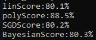
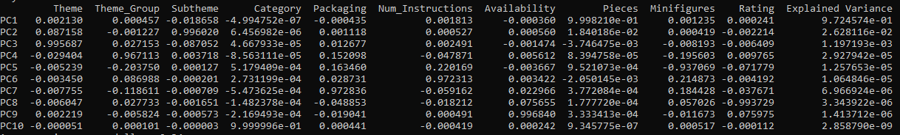
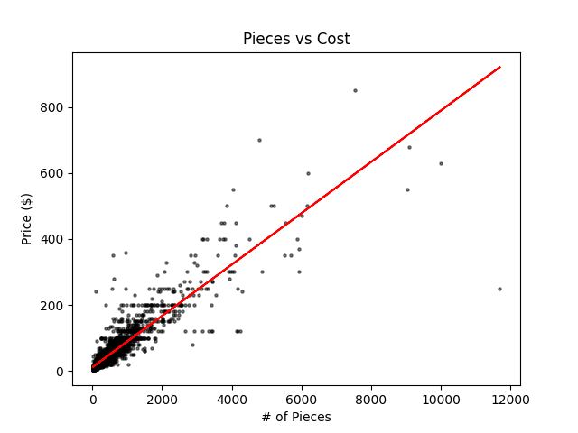
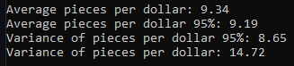

# DSF23 Final - Legos
### Ethan Greenwood

## Introduction:

We set out to familiarize ourselves with some of the regression models in scikit that I am unfamiliar with by attempting to predict the price of lego sets.

## Data

[This](https://www.kaggle.com/datasets/alexracape/lego-sets-and-prices-over-time/data) Kaggle dataset was utilized. It is a combination of retail and resale data for lego parts, sets, and other memorabilia. With sixteen (16) features, 15k rows, and a tremendous amount of NaN and Null values, significant pre-processing was required. The NaN values can be filled with zeros (0), as they are found where the database lacked input for the field (when there was none of something). Several features altogether were meaningless, and were trimmed. This included things like the set ID or the set name. Since we set out to predict the price of the sets themselves, various filters were applied to eliminated single-part listings. The final trimmed data has ten (10) features, and 4290 samples. After factorizing the text categorical features, such as the Theme, the data was ready to be used. 

This data was split 80-20 train-test, and used to train four (4) models, a linear regression model, a SGD model, a Bayesian Model, and later a 2nd degree polynomial linear regression model. The polynomial linear regression model requires pre-factoring the higher order variables with the Polynomial Features function before training a new linear regression model with them. All four (4) models were saved after training using the joblib library in case they were wanted later.

## Tools

- NumPy
- Pandas
- joblib
- Scikit-learn
- SciPy
- Visual Studio 2022 for the IDE

Scikit Models Utilized:
- train-test-split
- linear regression model
- SGDRegression Model
- BayesianRidge Regression Model
- Pipeline
- Standard Scaler
- Polynomial Features to easily compute polynomial inputs
- PCA

## Outcome

- Of the four (4) models that were trained, only the polynomial model stood out, the remaining three scored near identically.

- Performing a Principal Component Analysis shows that the likely reason for the close scores is the reliance on a single feature: Pieces. The first principal component accounts for over 97% of the variance, and is by far the most heavily weighted to the number of pieces.

- Using a scatter plot, we can visually show this strong correlation between the number of pieces and the set price.

- Finally we calculated the pieces per dollar (P/$) of each set, and found the average is just over nine (9). We also calcuated the same using the inner 95% of the data (trimmed off potential outliers that were in the outter 5% in terms of distance from the mean). The pieces per dollar value barely shifts from this, indicating a good distribution with few outliers.

## Discussion

After training the linear, SGD, and BayesianRidge regression, and seeing how similar their scores were, I realized I need to dig deaper. I would expect them to be close, given that they are all linear models, but being withing a rounding error of each other seemed like too close of a grouping. This led to utilizing a PCA to find that the most important feature is, by far, the number of pieces. Unsatisfied with only 80%, I decided to retrofit the linear model to perform a polynomial regression using SciKit's Polynomial Features function. This performed the best, a flat 8% increase over the other three. I came to the realization, however, that in terms of utilizing the model, it would be by far easier for the end-user to only need to input one (1) value instead of ten (10), so using this model was scrapped in favor of a hyper simple linear model (dividing the inputed number of pieces by nine (9)).

While looking online afterwards, I stumbled uppon two interesting pieces of information.
1. The average number of pieces per dollar is apparently close to 11.
2. Weight, a feature not present in my data, is even more heavily correlated [(up to 95%)](https://www.eurobricks.com/forum/index.php?/forums/topic/172849-price-per-piece-an-outdated-idea/).

## Summary

The best method for estimating a Lego set's price is to use number of pieces. Other information, such as the licensing or theme have far less bearing on the final retail price of a set.
